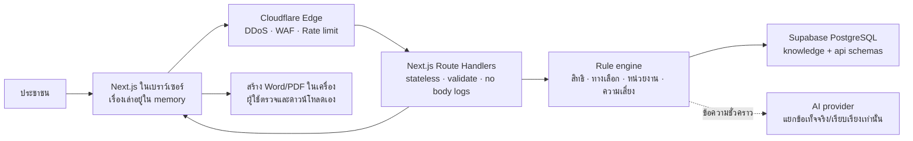

# สถาปัตยกรรมระบบสิทธิไปต่อ

สถานะ: Architecture baseline สำหรับ MVP  
หลักตัดสินใจ: **Rules-first, source-backed, stateless, no citizen-content retention**

## 1. เป้าหมาย

ระบบต้องช่วยประชาชนตัดสินใจอย่างมีข้อมูล โดยไม่ให้ AI เป็นผู้วินิจฉัยการละเมิดสิทธิหรือเลือกหน่วยงานตามลำพัง และไม่สร้างฐานข้อมูลคดีเงาที่เก็บเรื่องละเอียดอ่อนของประชาชน

## 2. ภาพรวม

## 3. ขอบเขตข้อมูล

### เก็บถาวร

- แหล่งข้อมูลทางการและ checksum
- เอกสาร/ส่วนเอกสารที่ผ่านการทบทวน
- สิทธิ คำอธิบายภาษาง่าย และข้อควรระวัง
- ประเภทปัญหา หน่วยงาน ช่องทางติดต่อ และขอบเขตอำนาจ
- กฎส่งต่อ กฎความเสี่ยง รายการหลักฐาน และแม่แบบหนังสือ
- สถานะ Draft/Reviewed/Published/Retired, วันมีผล, วันหมดอายุ, วันตรวจล่าสุด
- audit trail ของกระบวนการบรรณาธิการในระดับบทบาท ไม่ใช่ข้อมูลประชาชน

### ไม่เก็บถาวร

- บัญชีหรือโปรไฟล์ประชาชน
- เรื่องเล่า คำตอบแบบคัดกรอง prompt หรือ model output
- หลักฐาน ร่าง/ไฟล์หนังสือร้องเรียน หรือประวัติสนทนา
- analytics ที่มีข้อความ คำค้น หรือค่าฟอร์มของผู้ใช้

จึงไม่มีตาราง `users`, `cases`, `case_answers`, `conversation_history` หรือ `generated_complaints`

## 4. ชั้นฐานข้อมูล

PostgreSQL เหมาะกับข้อมูลที่มีความสัมพันธ์และต้องรักษาเวอร์ชัน/ความถูกต้อง ส่วน `pgvector` ใช้ค้นตามความหมายโดยไม่ต้องมี vector database แยก

- `knowledge`: ตารางจริง กฎ เวอร์ชัน และกระบวนการตรวจทาน ไม่อยู่ใน exposed Data API schema
- `api`: security-invoker views/functions ที่เปิดเฉพาะข้อมูล `published` และยังมีผล
- `extensions`: `pgcrypto`, `vector`, `pg_trgm`

Data API เปิดเฉพาะ `api` ตาม `supabase/config.toml` บทบาท `anon` มีเพียง SELECT/EXECUTE ที่ระบุและถูก RLS ซ้ำอีกชั้น ไม่มีสิทธิ INSERT/UPDATE/DELETE ส่วนการแก้ฐานความรู้ในระยะต่อไปต้องผ่าน admin service แยกต่างหาก

การค้นภาษาไทยใช้สามสัญญาณ:

1. Structured filters จากประเภทปัญหา พื้นที่ ผู้เกี่ยวข้อง และวันที่ข้อมูลมีผล
2. Keyword/trigram search (`tsvector` แบบ `simple` + `pg_trgm`)
3. Semantic similarity (`pgvector`)

ฟังก์ชัน `api.search_knowledge` จำกัด query 2–300 ตัวอักษรและผลลัพธ์สูงสุด 20 รายการ Embedding dimension เริ่มที่ 1536; ต้องยืนยันโมเดล embedding ก่อนนำเข้าข้อมูลจริง หากเปลี่ยน dimension ให้สร้าง migration ใหม่

## 5. ความถูกต้องแบบ Rules-first RAG

1. Browser เก็บคำตอบชั่วคราวและส่งเฉพาะเมื่อผู้ใช้กดดำเนินการ
2. API ตรวจขนาด รูปแบบ และตัดข้อมูลที่ไม่จำเป็น
3. ตัวแยกข้อเท็จจริงสร้าง structured facts แต่ยังไม่ให้คำแนะนำ
4. Rule engine เลือกสิทธิ ทางเลือก หน่วยงาน และ risk flags จากกฎ `published`
5. Hybrid search ดึงข้อความทางการที่ยังมีผลพร้อม source URL/วันที่ตรวจล่าสุด
6. AI อธิบายผลกฎด้วยภาษาง่ายและเรียบเรียงข้อเท็จจริง โดยห้ามเพิ่มมาตรา ช่องทาง หรือหน่วยงานที่ไม่มีใน context
7. Output validator ตรวจว่าทุกข้ออ้างมี source, หน่วยงานตรงกับ rule result, ไม่ฟันธงการละเมิด และไม่เปิดเผยข้อมูลเกินจำเป็น
8. Confidence ต่ำ/ข้อมูลขัดกัน/เสี่ยงสูง → ถามเพิ่มหรือส่งต่อผู้เชี่ยวชาญ

เอกสารที่ค้นคืนทั้งหมดถือเป็น **untrusted data** ไม่ใช่คำสั่งให้โมเดลหรือระบบ เพื่อจำกัด indirect prompt injection

## 6. ชั้นแอปพลิเคชัน

- App Router ใช้ Server Components เป็นค่าเริ่มต้น
- Client Component ใช้เฉพาะฟอร์มและการสร้างไฟล์ในเบราว์เซอร์
- Route Handlers เป็น public API boundary; Browser ไม่เชื่อม Supabase โดยตรง
- `SUPABASE_URL` และ publishable key เป็น server-side environment variables แม้ publishable key ไม่ใช่ secret เพื่อป้องกันการขยาย API surface โดยไม่ตั้งใจ
- service-role/secret key และ AI key ห้ามมีชื่อขึ้นต้น `NEXT_PUBLIC_`

Endpoint ปัจจุบัน:

- `GET /api/health` — liveness เท่านั้น ไม่ตรวจฐานข้อมูลเพื่อไม่ขยาย blast radius
- `GET /api/knowledge/agencies` — read-only, input จำกัด 80 ตัวอักษร, cache ที่ edge

Endpoint ที่จะเพิ่มหลัง WAF พร้อม:

- `POST /api/analyze` — structured facts แบบ transient
- `POST /api/generate` — คืนข้อมูลสำหรับสร้างเอกสารใน browser; ไม่เก็บสำเนา

## 7. Deployment

- Next.js 16 บน Cloudflare Workers ผ่าน `@opennextjs/cloudflare`
- Cloudflare เป็น public edge สำหรับ DDoS, WAF, bot controls, rate limiting และ cache
- Supabase Hosted PostgreSQL เป็น knowledge store; เปิด Data API เฉพาะ `api`
- ไม่มี origin server อื่นที่เปิด IP ต่อสาธารณะ

`wrangler.jsonc` ปิด invocation logs และโค้ดห้าม `console.log` request bodies Metrics ที่อนุญาตต้องเป็นจำนวนรวม latency/error/status เท่านั้น

## 8. เส้นทางย้ายระบบ

PostgreSQL schema และ migration เป็น portable core หากต้องย้ายสู่ Government Cloud ให้ย้ายฐานข้อมูล, เปลี่ยน secret/connection layer และคง `knowledge`/`api` contracts เดิม ส่วน Cloudflare สามารถแทนด้วย edge/WAF ที่มีคุณสมบัติเทียบเท่าโดยไม่แก้ domain model

## 9. Architecture decision records

- ADR-001: PostgreSQL + pgvector แทน NoSQL/vector service แยก
- ADR-002: Rules-first ก่อน AI generation
- ADR-003: ไม่มี citizen/case persistence ใน MVP
- ADR-004: Browser-generated documents และ user-controlled submission
- ADR-005: Dedicated `api` schema + security-invoker + RLS + explicit grants
- ADR-006: Cloudflare Workers/OpenNext เป็น compute/edge boundary

## 10. เรื่องที่ต้องตัดสินใจก่อน Sprint 2

- ประเภทปัญหานำร่องเพียง 1 ประเภท
- ผู้เชี่ยวชาญเจ้าของข้อมูลและ SLA การตรวจทาน
- AI/embedding provider, data-processing terms, region และ zero-retention setting
- เกณฑ์ความมั่นใจที่ต้องส่งต่อมนุษย์
- หน่วยงานปลายทาง 3–4 แห่งและ source of truth ของแต่ละช่องทาง
